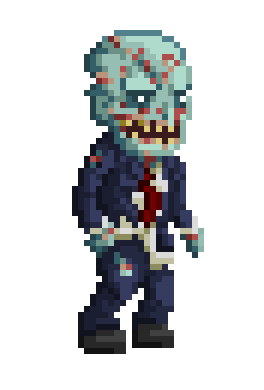
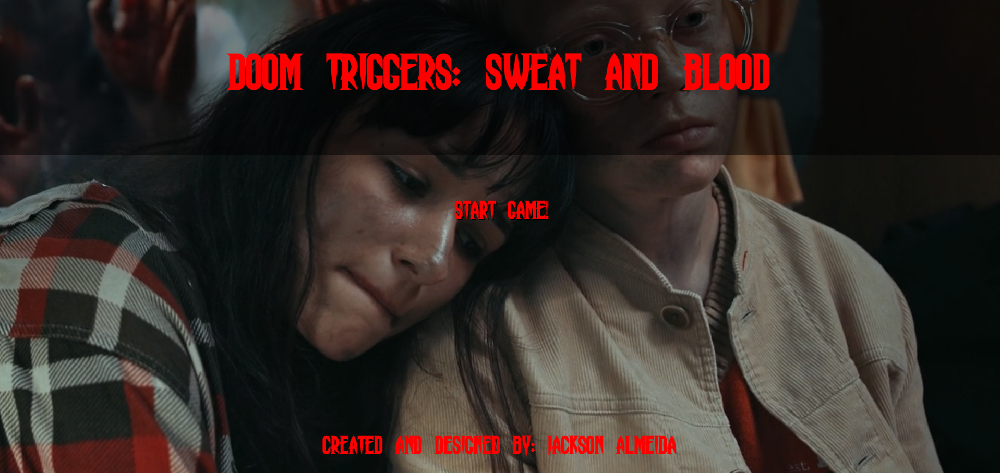
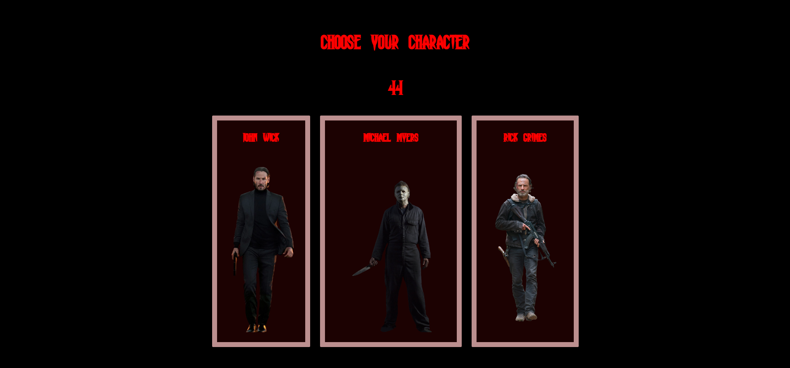
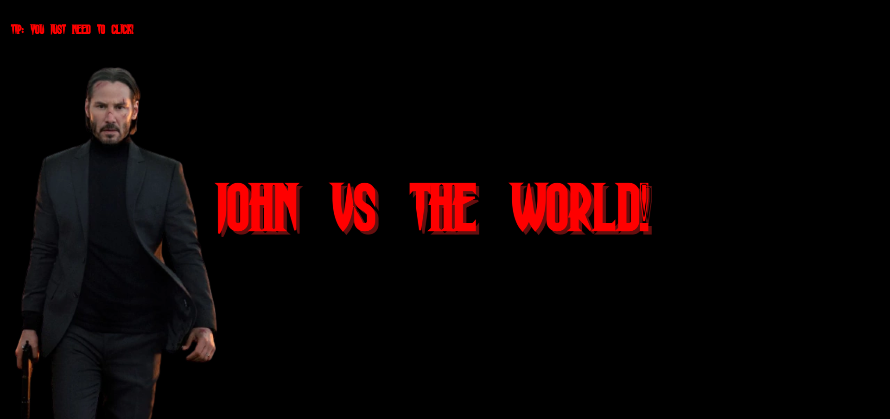
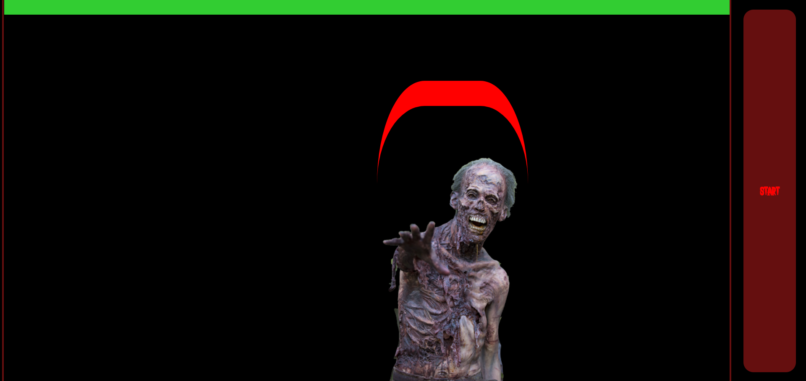
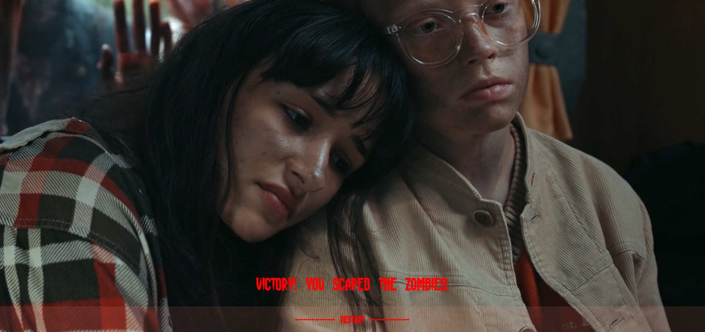

<h1 align="center">
 👾Doom Triggers:Sweat and Blood👾
</h1>

<h3 ><em> Created by: </em></h3>
 
<em> - Jackson Almeida Da Luz - </em>

<h4 align="center">Game created with only <em>Vanilla JS</em>, <em>CSS3</em>, <em>HTML5.</em></h4>

  <a href="">About the Page</a> 
    -
   
  <a href="">Shots from the Page</a>

 
<h2>About the page</h2>

**GAME (Doom triggers: sweat and blood)** created from cero with no templates.
 
In this game, is added a lot of functions, and methodologies practised in Geekshubs... conceps as Asyncrony, and things such as DOM and Classes.
 

 
Zombie Gif

 
<h2>Screenshots from the game</h2>

*Not everything is included
 
*You can see it on: <em> https://99jack99.github.io/Game-DoomTriggers/</em>
 
 

<ins>Landing page:</ins>
Game name, and start.

 

 

<ins>Select Character:</ins>
Pool selection and countdown.

 

 

<ins>Choosen Character Screen:</ins>
Screen with your character

 

 

<ins>Game:</ins>
Game mechanics, and gameplay.

 

 

<ins>Gameplay result:</ins>
Victory screen

 

 

